# **Hostel Exploration System**

## **Overview**  
The **Hostel Exploration System** is developed using Java, JavaFX and MySQL that enables students to explore various hostels falling under the University of Mumbai(Bombay). It provides a **one-stop solution** for students to gather essential information about different hostels, such as **location, pricing, facilities, and contact details**, without needing to visit them physically.  

This project aims to **simplify the relocation process** for students by helping them find **safe, affordable, and home-like** accommodations conveniently.  

---

## **Features**  
✅ **Categorized Hostel Listings**: Hostels are classified into **Girls' Hostels, Boys' Hostels, and International Students' Hostels**.  
✅ **Hostel Owner Registration**: Hostel owners can register their hostels in the app.  
✅ **Admin Validation & Authentication**: 
   - Hostel registration requests are sent to the admin for verification.  
   - If **approved**, the hostel is added to the respective category.  
   - If **unauthorized or invalid**, the admin can reject the request to maintain security and reliability.  
✅ **Browse Hostels**: Students can view hostel details.
✅ **Direct Contact**: Allows students to contact hostels directly through the app.  
✅ **Search & Filter**: Find hostels based on personal preferences.  
✅ **Secure Database Integration** using MySQL.  
✅ **User-Friendly JavaFX Interface** for smooth navigation.  

---

## **Technology Stack**  
- **Frontend:** JavaFX  
- **Backend:** Java  
- **Database:** MySQL  
- **IDE Used:** Eclipse IDE

---

## **Installation & Setup**  

### **Prerequisites**  
Before running the project, ensure you have the following installed:  
- Java Development Kit (**JDK 11 or later**)  
- MySQL Database Server  
- MySQL Connector for Java  
- JavaFX SDK  

### **Steps to Set Up**  

1. **Clone the repository**  
```bash
git clone https://github.com/asaavi30/FarFromHome-Hostel_Exploration_System.git
```

2. **Set up the database**  
- Create a MySQL database (`hostel_db`).  
- Import the provided **SQL script** (`database.sql`) into MySQL.  
- Update the database credentials in `DatabaseConnection.java`.
- Create tables with the column names as present in the screenshots. 

3. **Run the application**  
- Open the project in your preferred IDE.  
- Ensure JavaFX libraries are correctly configured.  
- Run `Main.java` to start the application.  

---

## **User Roles & Functionality**  

### **Students:**  
- View hostels categorized into **Girls' Hostels, Boys' Hostels, and International Students' Hostels**.  
- Search and filter hostels based on preferences.  
- View detailed hostel information (location, pricing, facilities, contact details).  
- Contact hostels directly.  

### **Hostel Owners:**  
- Register their hostels through the app.  
- Their request is sent to the **admin for verification and authentication**.  
- Once approved, the hostel is added to one of the **three categories**.  

### **Admin:**  
- Validate and approve hostel registrations.  
- **Reject unauthorized or invalid hostels**.  
- Manage hostel listings.  
- Ensure only verified hostels are available in the system.  

---

## **Screenshots**  

### Main Screen 
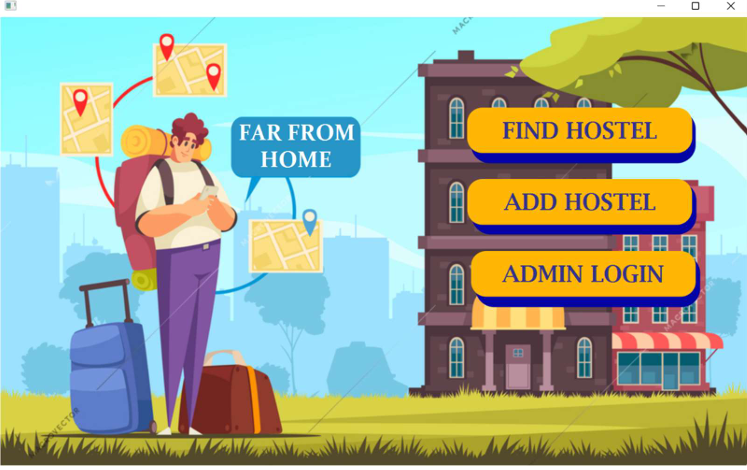

### Clicking on ‘Find Hostel’ 
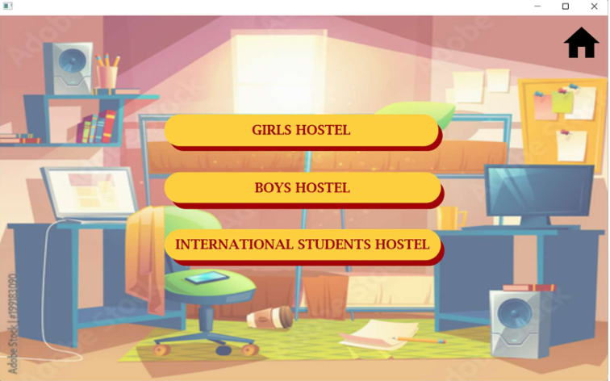

### Clicking on ‘Girls Hostel’ 
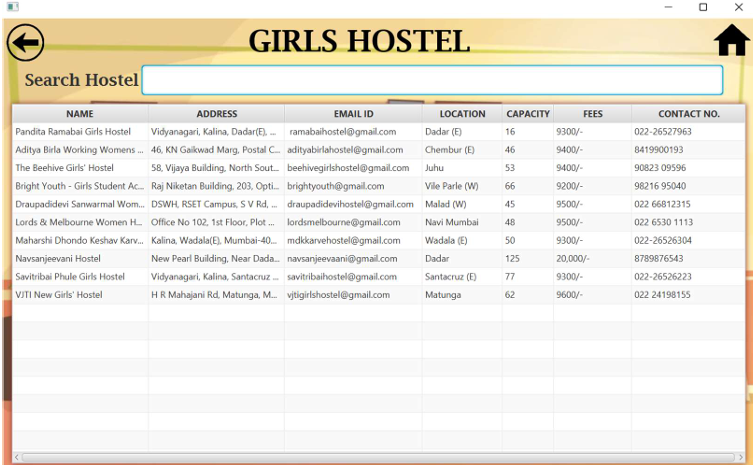

### Clicking on ‘Boys Hostel’ 
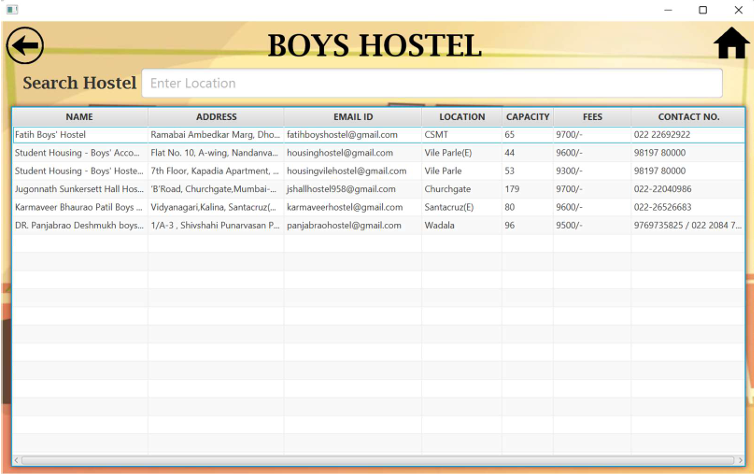

### Clicking on ‘International Students Hostel’ 
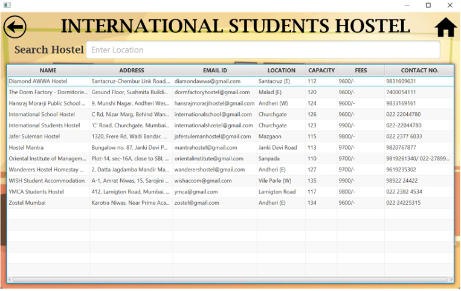

### Clicking on ‘Add Hostel’ 
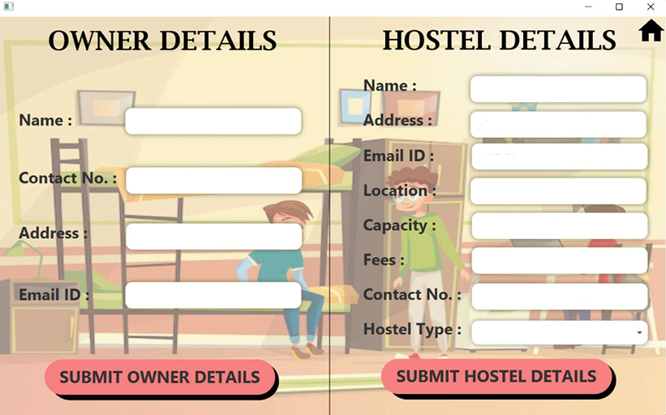

### Clicking on ‘Submit Hostel Details’
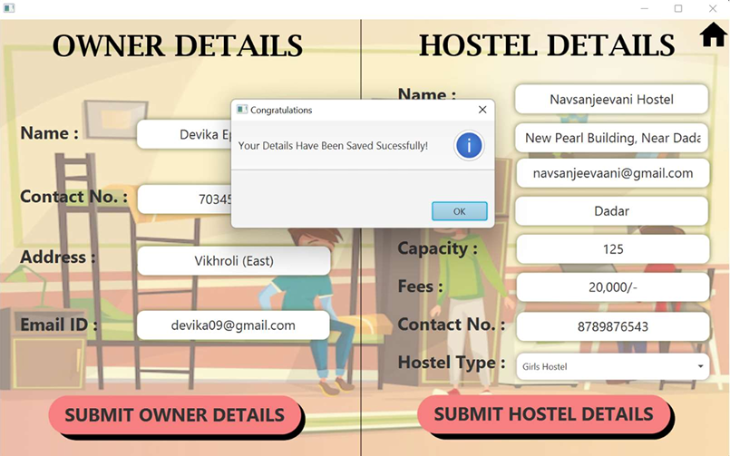

### Clicking on ‘Admin Login’ 
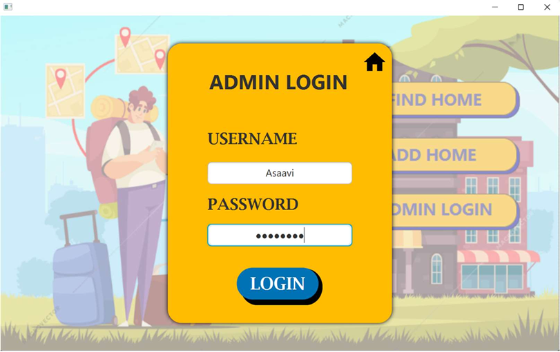

### Clicking on ‘Login’ 
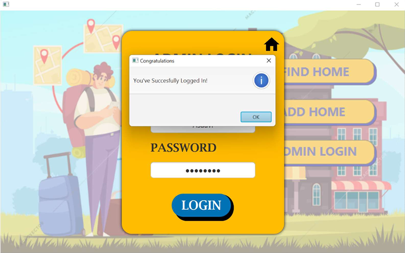

### Clicking on ‘Update Requests’ 
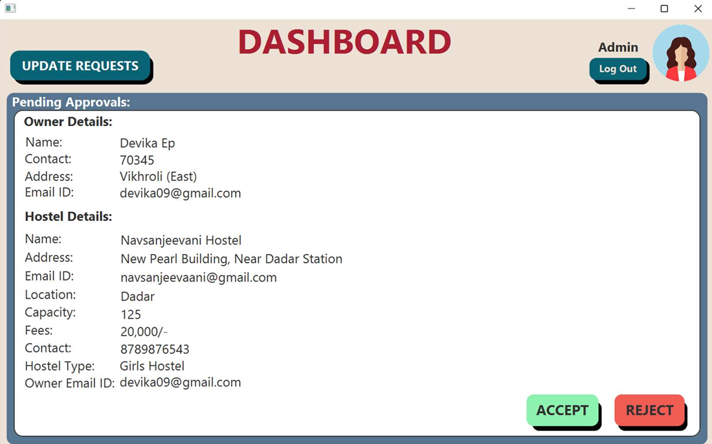

### When the Admin clicks on ‘Accept’ to accept the request 
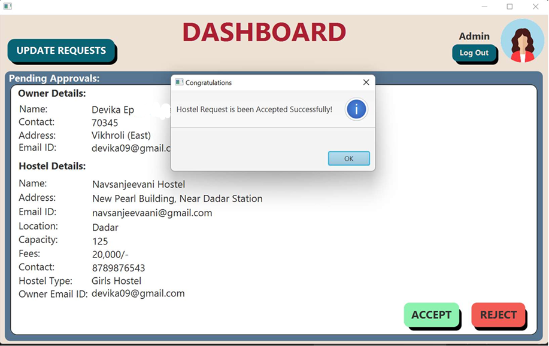

### When the Admin clicks on ‘Reject’ to reject any Hostel Request 
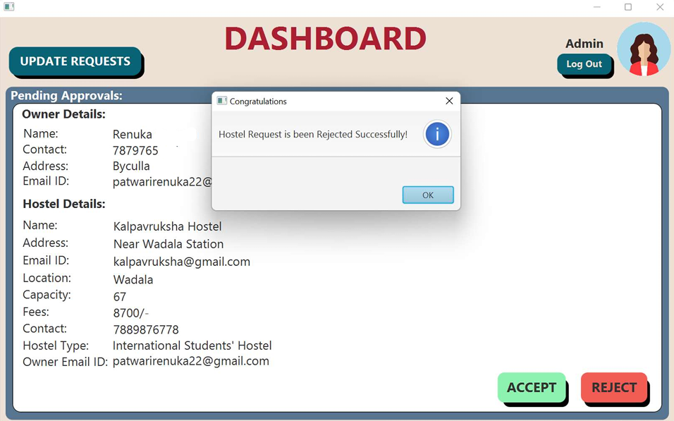

### Admin’s Login Details Database table 
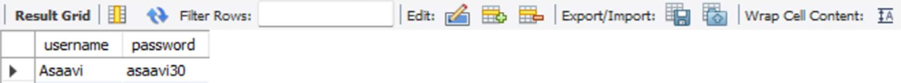

### Girls Hostel Details Database Table 
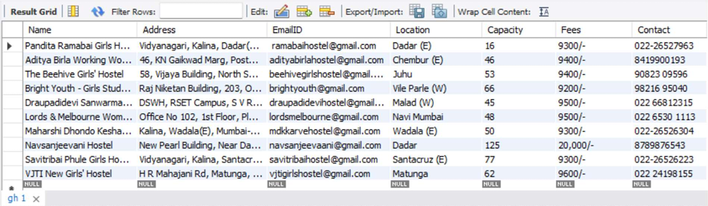

### Boys Hostel Details Database Table 
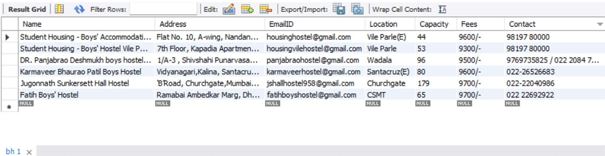

### International Students Database Table 
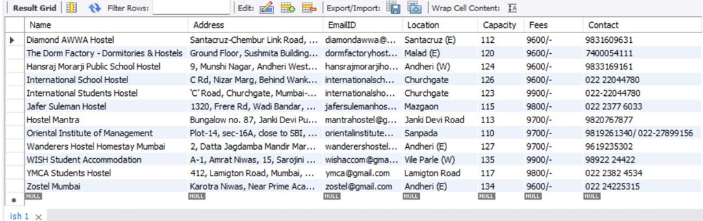

### Submitted but pending Hostel Details 
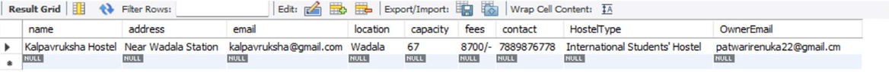


---
